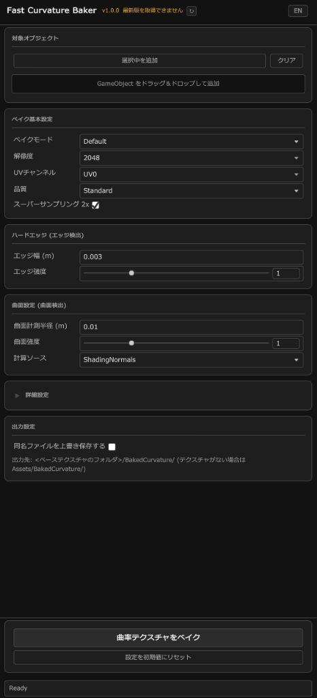

# Fast Curvature Baker User Guide

**Fast Curvature Baker** is a high-speed GPU-accelerated curvature map baking tool for Unity.  
Easily generate edge wear, crevice dirt/shadow masks, and smooth curvature gradient maps for 3D meshes with a single click.

---

## UI Overview

---

## Getting Started

Open the window from the Unity top menu: **`dennokoworks` > `Fast Curvature Baker`**.

---

## Features & Settings

### 1. Top Bar (Header)

- **Title**: `Fast Curvature Baker`
- **Version Display**: Shows the current tool version (e.g., `v1.0.0`). It automatically checks for updates on startup.
  - `Update Available <Version>`: Displayed when a newer release is found.
  - `Could not check for updates`: Displayed if a network or retrieval error occurs.
- **Refresh Button (`↻`)**: Manually retries the version check.
- **Language Button (`[EN] / [JA]`)**: Switches the UI language between English and Japanese with a single click (preference is saved).

---

### 2. Target Objects

Specifies the meshes to bake (`GameObject`s containing a `MeshRenderer` or `SkinnedMeshRenderer`).

- **`Add Selected`**: Adds the currently selected GameObjects in the Hierarchy or Scene to the list.
- **`Clear`**: Clears all registered target objects.
- **Drag & Drop Area**: Drag and drop GameObjects directly from the Project or Hierarchy window.
- **Target List**: Lists registered GameObjects. Each entry has a **`×`** button on the right to remove it individually.

---

### 3. Bake Settings

| Setting | Description | Effect of Changing |
|---|---|---|
| **Bake Mode** | Selects the type of curvature map to output. • **Default**: Signed curvature (flat = 0.5, convex = white, concave = black). • **Convex**: Convex edges only (highlights, scratches, worn edge masks). • **Concave**: Concave crevices/valleys only (dirt, ambient shadows, dust masks). | Switches between grayscale masks and full signed curvature maps according to your workflow. |
| **Resolution** | Pixel resolution of the output texture (256 to 4096). | **▲ Increase**: Sharper details and crisper lines, but increases bake time and memory usage. **▼ Decrease**: Faster baking and smaller file size, with lower detail. |
| **UV Channel** | The mesh UV channel to bake onto (UV0 to UV7). | Typically `UV0` is used for main material textures. |
| **Quality** | Number of sample points per radius query (Draft: 4 points, Standard: 6 points, High: 8 points, Ultra: 12 points). | **▲ Increase**: Reduces sample noise and improves accuracy, but takes longer to compute. **▼ Decrease**: Useful for fast iteration and parameter preview. |
| **Supersample 2x** | Computes curvature internally at 2x resolution and downsamples with box averaging (automatically disabled at 4096). | **ON**: Greatly reduces aliasing (jagged edges) along UV seams and thin features. **OFF**: Reduces baking time. |

---

### 4. Hard Edges (Edge Detection)

Detects sharp creases and hard normal breaks between polygon faces.

| Setting | Description | Effect of Changing |
|---|---|---|
| **Edge Width (m)** | World-space width (in meters) around sharp edges to detect curvature. | **▲ Increase**: Widens the detected edge line for broader edge wear. **▼ Decrease**: Produces a razor-sharp, thin edge line suitable for crisp mechanical borders. |
| **Edge Strength** | Multiplier for hard edge curvature. A value of 1.0 reaches full brightness at a 90-degree angle. | **▲ Increase**: Makes even gentle creases stand out boldly with high contrast. **▼ Decrease**: Softens edge influence. Setting to 0.0 disables hard edge detection. |

---

### 5. Smooth Surfaces (Surface Detection)

Detects smooth curvature across gentle surfaces and curved geometry.

| Setting | Description | Effect of Changing |
|---|---|---|
| **Radius (m)** | World-space radius (in meters) of the sampling sphere used to evaluate curvature. | **▲ Increase**: Captures broad geometry undulations and forms smooth, global gradients. **▼ Decrease**: Responds sensitively to fine micro-details and tight contours. |
| **Strength** | Multiplier for smooth surface curvature. A value of 1.0 reaches full brightness for a sphere whose radius equals `Radius`. | **▲ Increase**: Enhances contrast on gentle curvatures. **▼ Decrease**: Produces softer, subtler gradients. |
| **Source** | The normal source used for curvature calculation. • **ShadingNormals**: Uses vertex/interpolated normals (smooth shaded gradients). • **Geometry**: Uses actual polygon face normals (directly measures polygon mesh creases). | **ShadingNormals**: Delivers clean, smooth gradients even on lower-poly models. **Geometry**: Ideal for high-poly or hard-surface models where you want the mesh facet angles directly captured. |

---

### 6. Advanced Settings

Click the foldout header to reveal advanced parameters.

| Setting | Description | Effect of Changing |
|---|---|---|
| **Same Part Only** | Restricts sample points to the same connected mesh component as the query texel. | **ON**: Prevents accidental curvature crosstalk between separate overlapping parts (e.g., clothing resting over skin). **OFF**: Samples adjacent separate mesh parts together as a unified surface. |
| **Normal Rejection** | Dot product threshold rejecting sample points facing away from the texel normal (weight smoothly blends back over +0.25). | **▲ Increase**: Strictly eliminates interference from backfaces and thin sheet geometry. **▼ Decrease**: Ensures tight, steep crevasses are fully detected. |
| **Blur Passes** | Number of 3x3 separable Gaussian blur iterations applied post-bake (0 to 16 passes). | **▲ Increase**: Smooths out polygon stepping artifacts and high-frequency noise (slightly softens edges). **▼ Decrease**: Preserves maximum sharpness (0 = no blur). |
| **Dilation (px)** | Number of pixels to dilate texture data outward from UV island boundaries. | **▲ Increase**: Prevents dark seam artifacts at mipmapped distances or seams. **▼ Decrease**: Prevents overgrowth into closely packed UV islands. |

---

### 7. Output Settings

- **Overwrite Existing Files**:
  - **Unchecked (Default)**: If a file with the same name exists, automatically appends a space and sequence number (e.g., `Model_Curvature 1.png`, `Model_Curvature 2.png`) to avoid overwriting.
  - **Checked**: Overwrites the existing file directly.
- **Output Destination**:
  - If a base texture is assigned to the material: `<BaseTextureFolder>/BakedCurvature/`
  - If no base texture is found: `Assets/BakedCurvature/`

---

### 8. Action Buttons & Status Bar

- **`Bake Curvature Map`**: Starts the baking process. A progress bar will be displayed, and the operation can be cancelled at any time.
- **`Reset to Defaults`**: Resets all parameters to recommended default values.
- **Status Bar**: Located at the bottom of the window; displays current state messages such as `Ready`, `Baking...`, save confirmations, or error alerts.

---

## Use Cases & Tips

1. **Avatar & Costume Edge Wear / Chipping**
   - Set Bake Mode to `Convex` and `Edge Width` to a small value (`0.002` – `0.005`).
   - Assign the baked texture to rim light, roughness, or decal mask inputs in shaders like lilToon or Poiyomi to simulate realistic metal edge abrasion or leather wear.

2. **Crevice Dirt & Shadow Masks**
   - Set Bake Mode to `Concave`.
   - Multiply the baked texture into your base color or ambient occlusion slot to shade fabric folds, seams, and crevices where dust naturally collects.

3. **Substance Painter / 3D Painting Workflows**
   - Set Bake Mode to `Default`.
   - Export the map as a standard curvature input for smart materials, generators, and procedural masks in external 3D texturing suites.
